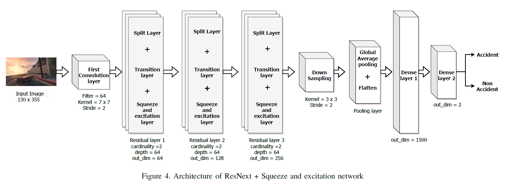

#Computer canada CODE
#in models/resNeXt5 is the ResNext_SENet model.

In recent days, with increased population and traffic on roadways, vehicle collision is one of the leading causes of death worldwide. The automotive industry is motivated on developing techniques to use sensors and advancements in the field of computer vision to build collision detection and collision prevention systems to assist drivers. In this article, a deep-learning-based model comprising of ResNext architecture with SENet blocks is proposed. The performance of the model is compared to popular deep learning models like VGG16, VGG19, Resnet50, and stand alone ResNext. The proposed model outperforms the existing baseline models achieving a ROC-AUC of 0:91 models using significantly less proportion of the GTACrash synthetic data for training, thus reducing the computational overhead.

• Trained the model from the video game images (GTA 5) and tested on the real-world car images (dash camera images). 
• Executed Object detection for detecting neaby vehicles and classified them as dangerous (red) or safe (green). 
• Deployed deep learning models (SeNet, ResNeXt, EfficientNet) to outperform the existing model by the ROC-AUC of 0.915. 
• We used computeCanada cloud clusters with the configuration: 100G of ram, 24 CPUs and 16G v100l GPU. Applications: it can be used to increase safety in self-driving vehicles and can improve anti-collision algorithms. 

